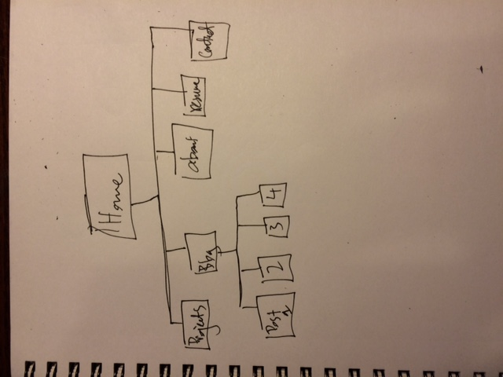

1. The 6 phases of web design are:

 1.Information gathering
   - Where you think about the purpose of the site, goals, target audience, and content

 2. Planning
    - Making a site map based on the info gathered from phase 1

 3. Design
    - Designing the site

 4. Development
    - Actually creating the site, prototyping

 5. Testing and delivery
    - Checking functionality, deliverying site to server

 6. Maintenance
    - Updates, upgrades, bug fixes

2. My site's primary goal will be to showcase my projects and direct people to my blog. The blog will consist of tech musings, aimed at the interested beginner.

3. The target audience's interests will be tech and coding, and that's what the blog posts will be about. Also, to show examples of the code, there will be a project section that showcases the projects I'm working on.

4. The primary action users should take is either looking for more info about me through accessing one of the options in the menu bar, such as an about section, or the projects section, and the other action will be to look through the blog posts. The menu bar will always be visible so it's easy to navigate to those sections, and the blog posts will be prominently displayed in the center of the page, drawing in the reader's attention.

5. The main things someone should know about design and user experience is that you want a page to be easily readable. As the designer, you're directing the user's actions, and you have to think about what the user would like to do (or what you would like the user to do), and how to make that easier for them. Also, the design of the site affects how the user experiences the site, if it's easy to navigate or confusing and difficult, if the user is satisfied afterwards or has a difficult time using the site.

6. User experience design is designing how a person feels when interacting with a system. For example, looking at a website is inherently different if you view it on your phone as opposed to a computer, the screen size and dimensions are different and this affects the information presented to the user. Also, a computer isn't touch screen, whereas a phone is, which effects the functionality and how a user intuitively interacts with the site. Effective design can create an easier and even delightful experience for the user, prompting them to return and enjoy the site. It can also influence the actions that users take on the site.

7. Oh my goodness, adding that image took forever! It took me the longest time to figure out why it wasn't working, and I finally I clicked on the image url on the page, copied and pasted it, and then realized the file extension was capitalized in the url for the actual image but not the url i had provided on the page (My code looked for the filepath was "imgs/sitemap.jpg" but the url was "https://github.com/jjshin85/phase-0/blob/master/week-2/imgs/sitemap.JPG" with the capital 'JPG'. So now I know that the url is case sensitive.

