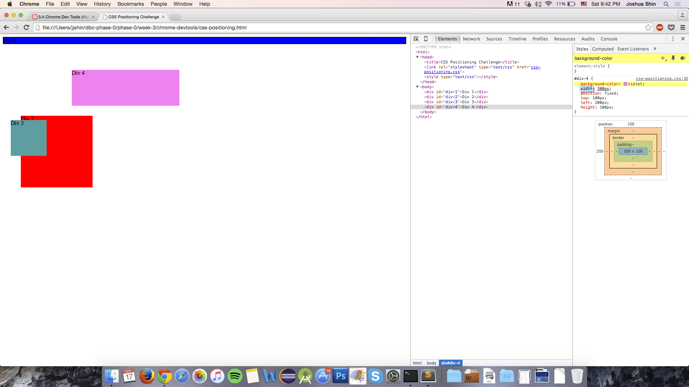
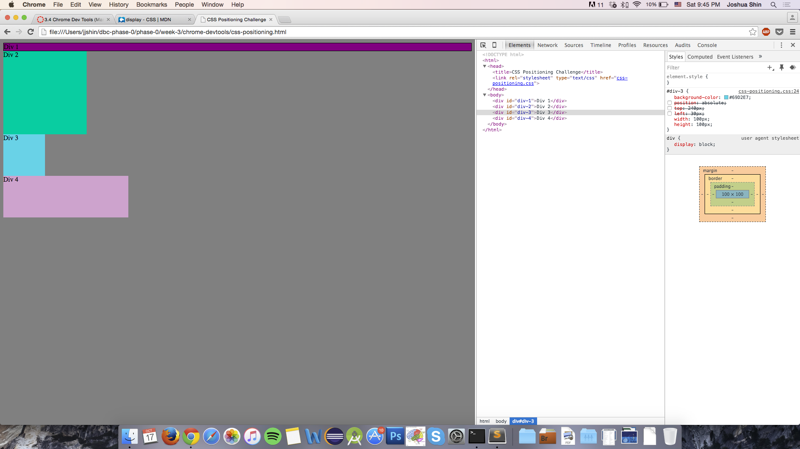
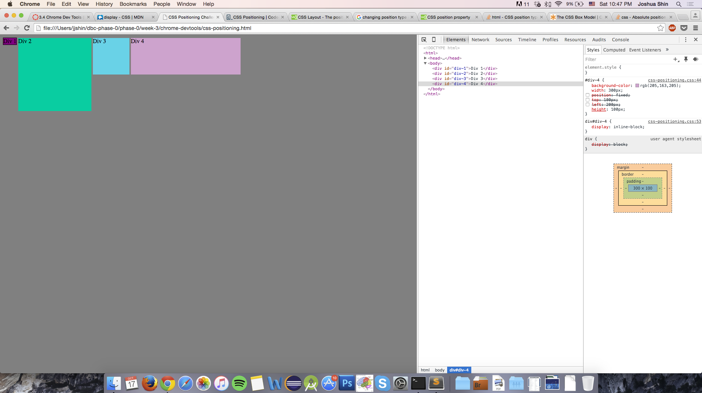
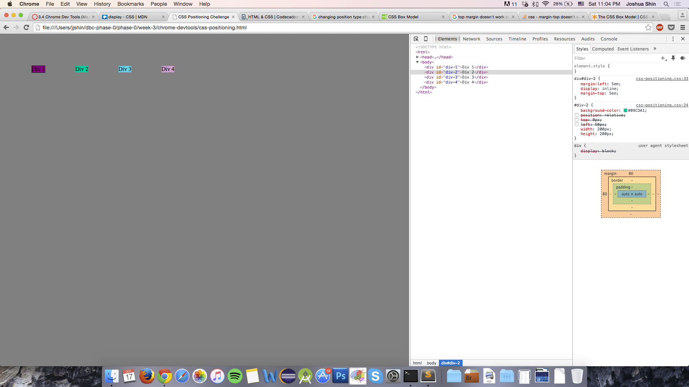
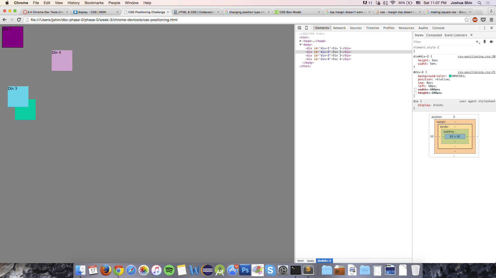
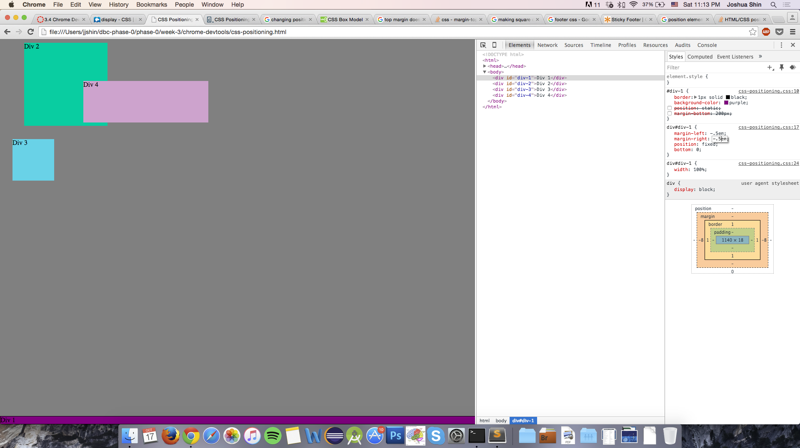
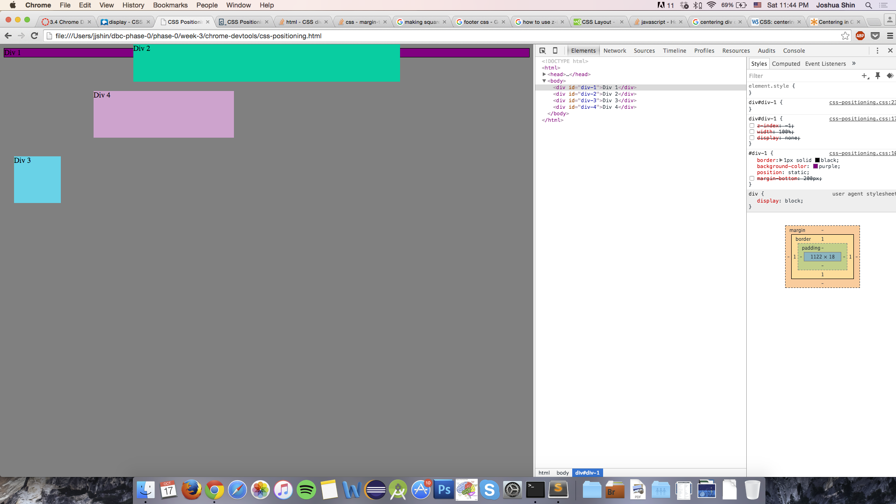
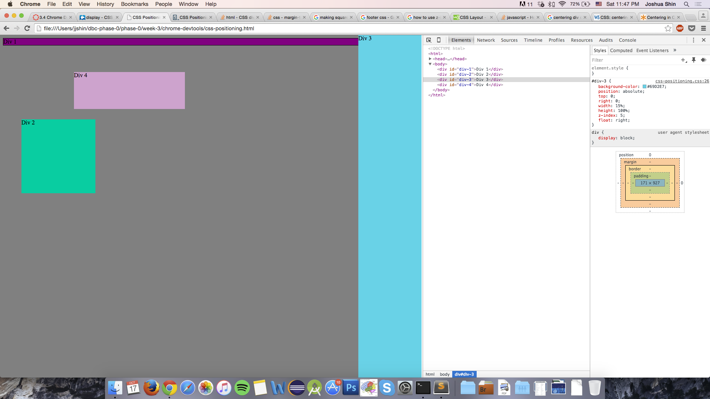
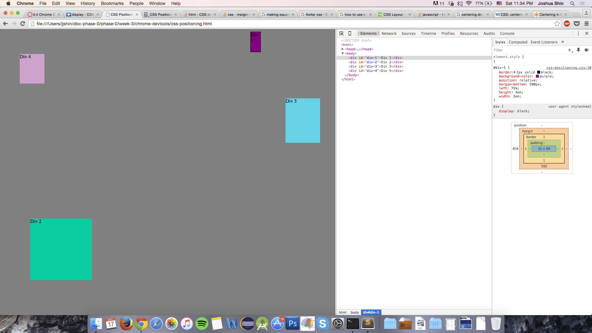

#Positioning Reflection

- How can you use Chrome's DevTools inspector to help you format or position elements?  
    The devtools show you how the treebranch structure looks, first showing you the parent elements and letting you click on them to show the nested elements they contain. Also, you can use the devtools to make changes to the html and css files to change the formatting, letting you see instantly what the changes will look like.  
  
- How can you resize elements on the DOM using CSS?  
  You can change the size properties in the CSS file by clicking the styles menu option. There you can add or choose a selector and give it a value.  
  
- What are the differences between Absolute, Fixed, Static, and Relative positioning? Which did you find easiest to use? Which was most difficult?  
  Static means the element is not given any special properties and is positioned according to the regular flow of the page. Relative means the position properties given to it affect it from where it would be positioned regularly, in the flow of the html document (if you change an element's positioning that's set to 'position: relative", it'll move the element in regards to where it would be normally). Fixed means that the element will never move from its position, regardless of if the user scrolls away. Absolute means that the element will be positioned in regards to its parent element.  
I found relative and absolute difficult to wrap my head around at first. With relative, it was hard to figure out where the element would be placed before I could figure out where to move it from that position. Absolute and static were confusing to differentiate at first and how elements tagged with each would affect each other.
  
- What are the differences between Margin, Border, and Padding?  
  Margin means the area outside the element, border means the area surrounding the element, padding means the area between the border and the content of the element.  
  
- What was your impression of this challenge overall? (love, hate, and why?)  
  It took me some time to wrap my head around how the different positioning properties affected the elements. It was a bit frustrating to figure out how the elements interacted, whether they would overlap, why they wouldn't overlap, why they would change shape if I changed the position property value from say static to absolute. The way that it worked was very counter-intuitive to me, so I found it quite difficult.  

Exercise 1: Change the Colors   
  
  
Exercise 2: Column   
  
Exercise 3: Row   

Exercise 4: Make Equidistant   
  
Exercise 5: Squares   
  
Exercise 6: Footer   
  
Exercise 7: Header   
  
Exercise 8: Sidebar   
  
Exercise 9: Get Creative 
