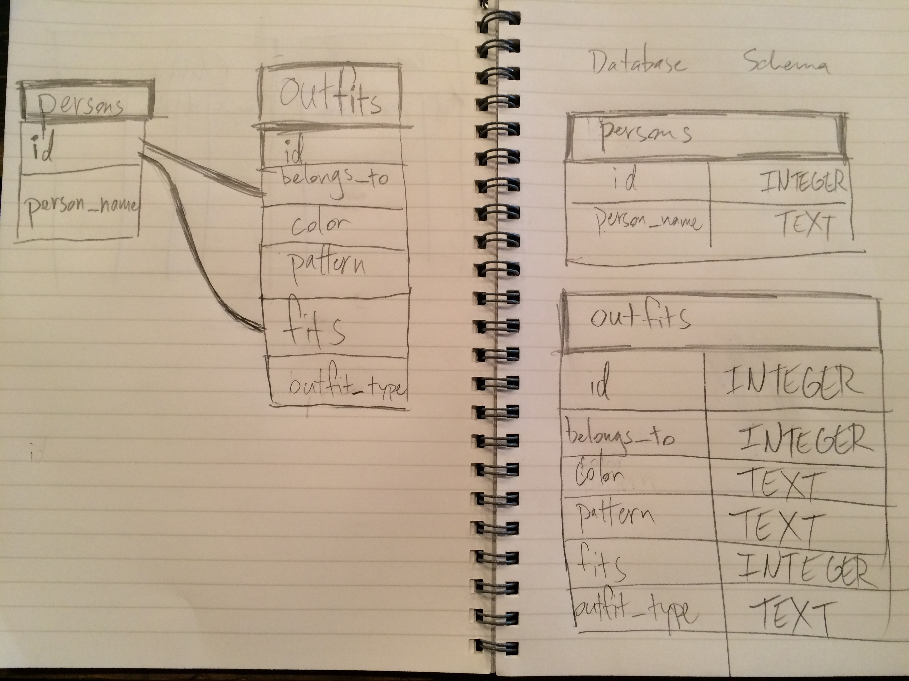

##8.4: Introduction to Database Schemas and SQL##

###Release 5 Commands:###

1. SELECT * FROM states;
2. SELECT * FROM regions;
3. SELECT state_name, population FROM states;
4. SELECT state_Name, population FROM states ORDER BY population DESC;
5. SELECT state_name FROM states WHERE region_id = 7;
6. SELECT state_name, population_density FROM states WHERE population_density>50 ORDER BY population_density;
7. SELECT state_name FROM states WHERE population BETWEEN 1000000 AND 1500000;
8. SELECT state_name, region_id FROM states ORDER BY region_id;
9. SELECT region_name FROM regions WHERE region_name LIKE '%central%';
10. SELECT region_name, state_name FROM regions, states WHERE regions.id = states.region_id ORDER BY region_id;

###Release 6: Your Own Schema###

###Release 7: Reflect###

- What are databases for?
  Databases are to hold large amounts of data. A relational database is used to hold large amounts of data while mapping their relationships. It stores data more like a hash map, keeping the relationship of data to one another intact.

- What is a one-to-many relationship?
  Where one piece of data is connected to many other pieces of data. For example, an id number for a student may be connected to all the different classes the student is enrolled in.

- What is a primary key? What is a foreign key? How can you determine which is which?
  A primary key is an object's main key, whereas a foreign key directs an object to the primary key of another object. They values of the keys may be the same, but they hold different importance for the different objects. For example, the primary key of a student might be that student's id number. A foreign key might be that student's class id number. If you traced the class id number to the table which holds the data about classes, you would see that the class id number is the primary key for that specific class.

- How can you select information out of a SQL database? What are some general guidelines for that?
  You have to use keywords and the order of the words is sometimes important. For example, you might write "SEARCH column_name FROM table_name;". The keywords are capitalized, you can use '*' as a wildcard which means everything, and also all commands must end with a semicolon.